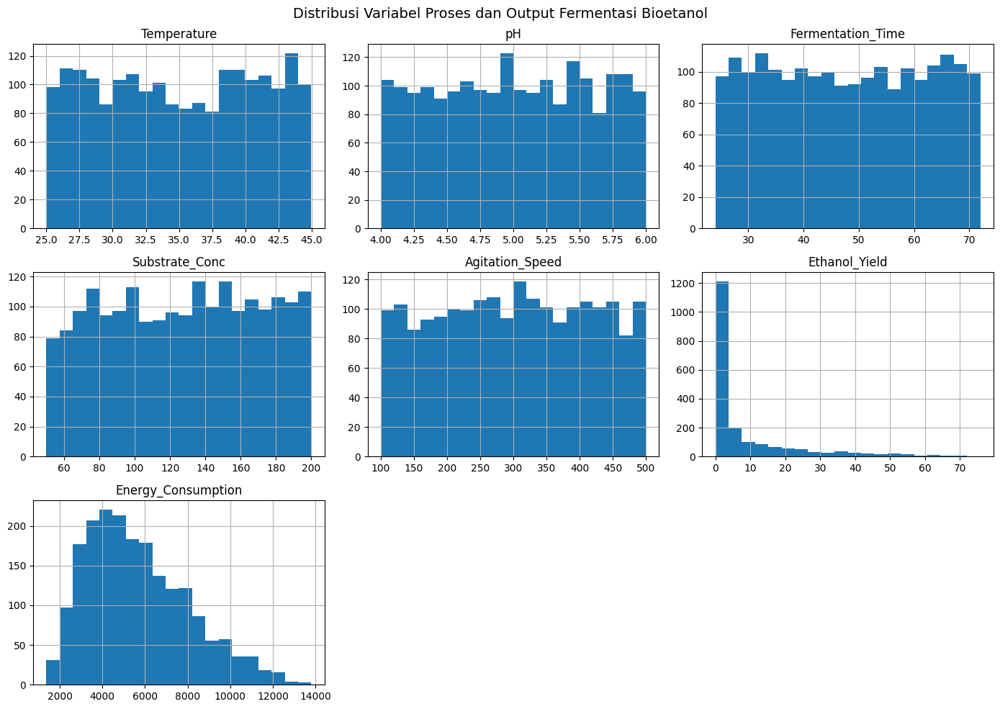
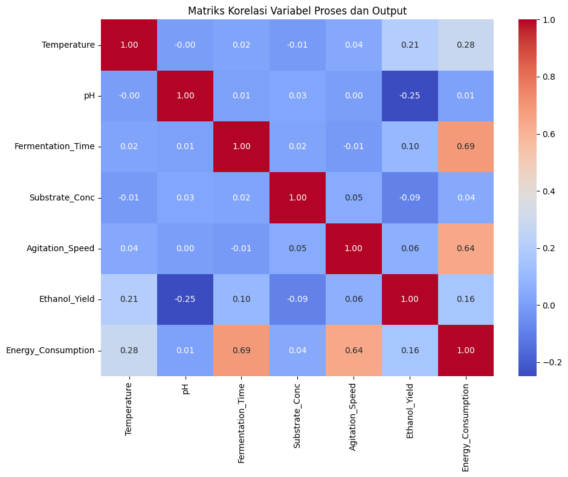

# TUGAS BESAR  
## Optimasi Bioreaktor Bioetanol Menggunakan Pendekatan Data-Driven dan Metaheuristik  

**Program Studi Teknik Industri Pertanian**  
**Universitas Linggabuana**

---

## Latar Belakang
Dalam proses fermentasi bioetanol, penentuan kondisi operasi sering kali tidak sesederhana mengikuti satu rumus baku. Perubahan kecil pada suhu, pH, atau konsentrasi substrat dapat memberikan dampak yang signifikan terhadap hasil etanol maupun konsumsi energi. Di sisi lain, tidak semua proses fermentasi memiliki model kinetika yang lengkap dan mudah digunakan.

Kondisi tersebut juga tercermin pada studi kasus dalam tugas besar ini, di mana data operasional bioreaktor tersedia dalam jumlah besar, namun hubungan antar variabelnya bersifat kompleks dan tidak linier. Oleh karena itu, pendekatan berbasis pengalaman semata menjadi kurang efektif. Tugas besar ini mencoba menjawab permasalahan tersebut dengan memanfaatkan data historis dan metode komputasi sebagai dasar pengambilan keputusan proses.

---

## Tujuan Tugas Besar
Tugas besar ini bertujuan untuk:
- Memahami perilaku proses fermentasi bioetanol melalui analisis data historis.
- Mengembangkan model prediksi berbasis Machine Learning sebagai representasi perilaku sistem.
- Mencari kondisi operasi bioreaktor yang memberikan hasil etanol tinggi dengan penggunaan energi yang lebih efisien.
- Menerapkan konsep optimasi metaheuristik dalam konteks nyata agroindustri.

---

## Data dan Variabel Proses
Data yang digunakan merupakan data historis operasi bioreaktor fermentasi bioetanol yang diasumsikan merepresentasikan kondisi operasi normal.

### Variabel Input
- Temperature (°C)
- pH
- Fermentation Time (jam)
- Substrate Concentration (g/L)
- Agitation Speed (rpm)

### Variabel Output
- Ethanol Yield (g/L)
- Energy Consumption (kWh/batch)

Dataset yang digunakan dalam analisis ini adalah:  
**`dataset_dindam_darusalam.csv`**

---

## Pendekatan dan Metode

### Exploratory Data Analysis (EDA)
Tahap awal difokuskan pada eksplorasi data untuk melihat pola umum, sebaran nilai, serta hubungan antar variabel proses. Hasil EDA menjadi dasar dalam memahami fenomena seperti inhibisi substrat, sensitivitas suhu, dan adanya trade-off antara produktivitas dan konsumsi energi.

---

### Pemodelan Machine Learning
Karena tidak tersedia persamaan matematis fermentasi yang eksplisit, digunakan pendekatan Machine Learning regresi sebagai surrogate model. Beberapa model dilatih dan dibandingkan performanya, antara lain:
- Linear Regression
- Random Forest Regressor
- Support Vector Regressor (SVR)
- Gradient Boosting Regressor
- K-Nearest Neighbors Regressor (KNN)

Model dengan performa prediksi terbaik dipilih untuk digunakan pada tahap optimasi.

---

### Optimasi Metaheuristik
Permasalahan optimasi dalam tugas besar ini bersifat multi-objective, yaitu memaksimalkan konsentrasi etanol dan meminimalkan konsumsi energi. Untuk mempermudah proses pencarian solusi, digunakan fungsi fitness berbobot:

\[
Fitness = (0.7 \times Norm\_Yield) - (0.3 \times Norm\_Energy)
\]

Bobot tersebut mencerminkan prioritas proses yang lebih menekankan pada peningkatan yield, tanpa mengabaikan efisiensi energi. Algoritma metaheuristik digunakan untuk menelusuri ruang solusi dan menemukan kombinasi variabel proses yang paling optimal.

---

## Hasil dan Interpretasi
Hasil optimasi menunjukkan bahwa pendekatan berbasis data mampu memberikan gambaran kondisi operasi yang lebih terstruktur dibandingkan pendekatan trial-and-error. Beberapa variabel proses terbukti memiliki pengaruh dominan terhadap yield etanol, sementara variabel lainnya lebih berkontribusi terhadap peningkatan konsumsi energi.

Temuan ini menegaskan pentingnya pendekatan optimasi yang mempertimbangkan lebih dari satu tujuan secara simultan.

---

## Rekomendasi
Berdasarkan hasil analisis dan optimasi, kondisi operasi yang diperoleh dapat dijadikan referensi awal dalam pengambilan keputusan operasional bioreaktor. Pendekatan ini berpotensi dikembangkan lebih lanjut sebagai alat bantu pengendalian proses berbasis data pada industri bioetanol.

---

## Tools yang Digunakan
- Python
- Google Colab / Jupyter Notebook
- Pandas dan NumPy
- Scikit-learn
- Matplotlib dan Seaborn

Seluruh proses dikerjakan menggunakan perangkat lunak open-source sesuai dengan ketentuan tugas besar.

---

## Identitas Penyusun
**Nama:** Dindam Darusalam  
**Program Studi:** Teknik Industri Pertanian  
**Universitas:** Universitas Linggabuana  

Tugas besar ini disusun sebagai bentuk penerapan konsep analisis data, pemodelan proses, dan optimasi dalam konteks agroindustri.

---

## Penutup
Melalui tugas besar ini, dapat disimpulkan bahwa integrasi data historis, Machine Learning, dan optimasi metaheuristik merupakan pendekatan yang relevan untuk menghadapi kompleksitas proses fermentasi bioetanol. Pendekatan ini membuka peluang pengambilan keputusan proses yang lebih rasional, terukur, dan berbasis data.
